 

 

ClickMe is an advanced framework for security professionals to create, test, and demonstrate **multi-step clickjacking vulnerabilities**. With an intuitive interface and powerful customization options, Clickme makes building complex proofs-of-concept for educational and security awareness purposes easy.

Try it now: <a href="https://clickme.hacking-poc.com/?menu=true">https://clickme.hacking-poc.com/?menu=true</a>

### What is multistep clickjacking
Multi-step clickjacking extends the deceptive principles of basic clickjacking into a more sophisticated and dangerous attack chain. While traditional clickjacking aims to trick users into performing a single unintended action, multi-step variants orchestrate coordinated interactions across multiple pages or states.

https://github.com/user-attachments/assets/a94b2fea-44e6-48a7-a858-8ec6f8e49c2d

| Normal Button | Captcha Checkbox | Captcha Puzzle |
| ------------- | ---------------- | -------------- |
|  |  |  |

## Key Features

| Feature | Description |
|---------|-------------|
| 🔄 **Multi-step Attack Design** | Create sophisticated clickjacking scenarios with multiple sequential steps |
| 👁️ **Real-time Preview** | Instantly visualize your attack flow as you build it |
| 🧩 **Customizable Elements** | Choose from buttons, CAPTCHAs, input fields, and custom scripts |
| 🖼️ **Background Options** | Select from various background types to enhance disguise effectiveness |
| 💾 **Export Functionality** | Export your POC for demonstrations or educational purposes |
| 🔍 **Transparency Controls** | Fine-tune overlay transparency for optimal attack design |

Clickme is only designed for educational purposes, security research, and authorized penetration testing. Always obtain proper authorization before testing clickjacking vulnerabilities on any system or website. Unauthorized testing may violate laws and terms of service.
 

## License

This project is licensed under the MIT License - see the [LICENSE](LICENSE) file for details.
 

## Contributing

Contributions are welcome! Please feel free to submit a Pull Request.

1. Fork the project
2. Create your feature branch (`git checkout -b feature/amazing-feature`)
3. Commit your changes (`git commit -m 'Add some amazing feature'`)
4. Push to the branch (`git push origin feature/amazing-feature`)
5. Open a Pull Request

## 🧰 Hacking Notes Ecosystem

🌐 &nbsp;**[hacking-notes.com](https://hacking-notes.com)** &nbsp;·&nbsp; ✍️ &nbsp;**[blog](https://hacking-notes.medium.com/)** &nbsp;·&nbsp; 💬 &nbsp;**[discord](https://discord.gg/r68ameNHrD)**

| | Resource | What you get |
| :-: | -------- | ------------ |
| 🗺 | **[Hacker-Roadmap](https://github.com/Hacking-Notes/Hacker-Roadmap)** | Structured paths from beginner to pro — hobbyist, bug bounty, certs & degree. |
| 🔴 | **[RedTeam Notes](https://github.com/Hacking-Notes/RedTeam)** | Offensive security notes: recon, exploitation, Windows & Linux. |
| 🔷 | **[BlueTeam Notes](https://github.com/Hacking-Notes/BlueTeam)** | Defensive security notes: forensics, malware, log & packet analysis. |
| 🧩 | **[Extensions](https://github.com/Hacking-Notes/Extensions)** | Curated Chrome extensions for ethical hacking & recon. |
| 🔖 | **[Bookmarks](https://github.com/Hacking-Notes/Bookmarks)** | Curated hacker bookmark collection, one import away. |

<a href="#top">⬆ back to top</a>

